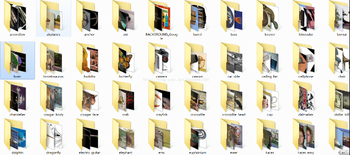
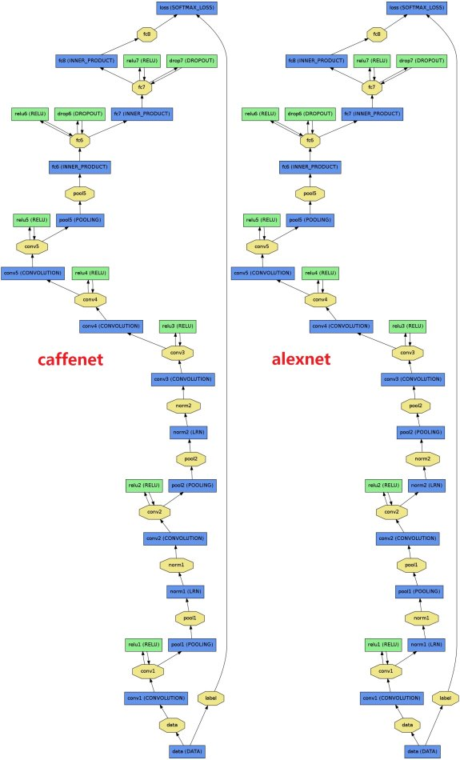
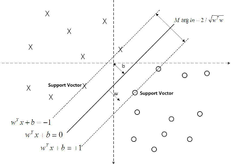
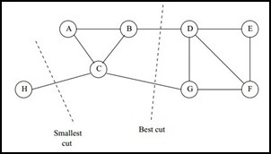

# 机器学习实验报告—— Caltech-102 图像分类和聚类


小组成员：
  彭宝云，16069009
  程鹏，    16069028
  刘雍，    16069034
  
-------------------

[TOC]

## 实验概述

&emsp;&emsp;使用机器学习方法对图像集[Caltech102](https://www.vision.caltech.edu/Image_Datasets/Caltech101/)进行分类和聚类，Caltech102是一个带标签的图像分类数据集，9145张图片，分属于102中物体类别，每个类别包含的图片数量从40到800不等，该数据集是在2003年由Fei-Fei Li, Marco Andreetto 和 Marc Aurelio Ranzato等人发布。图像大小基本都在 300 x 200左右。图像集地址:
https://www.vision.caltech.edu/Image_Datasets/Caltech101/



## 实验设计与具体步骤

&emsp;&emsp;方法流程：图像采用卷积神经网络CNN对图像提取特征，再使用分类器对图像进行分类，采用聚类方法对相似图片进行聚类。给出实验代码，给出实验结果并对结果进行详细解释。 

### 构建训练集和测试集
&emsp;&emsp;制作训练集和测试集的list文件（test_list.txt, test_list.txt），文件内容包含每一图片路径和类别，如下：
```
data/101_ObjectCategories/headphone/image_0028.jpg 0
data/101_ObjectCategories/headphone/image_0030.jpg 0
data/101_ObjectCategories/headphone/image_0011.jpg 0
...
data/101_ObjectCategories/binocular/image_0017.jpg 101
data/101_ObjectCategories/binocular/image_0026.jpg 101
data/101_ObjectCategories/binocular/image_0025.jpg 101
``` 
&emsp;&emsp;该 list 文件将被用在微调卷积网络中，指示输入的图片数据。
训练集和测试集比例分别为 0.7 : 0.3 ，训练集用训练模型，测试集验证模型的分类性能。

### CNN对图像提取特征
 &emsp;&emsp;直接使用图像进行分类不可行，一般做法都是先使用特征提取方法对图像进行特征提取，形成特征向量后，再使用分类器来对特征向量进行训练和分类。传统常用的特征提取方法有Haar，HOG，SIFT 和 LBP， 这类方法提取的特征都是手工设计的。本实验中采用CNN来对图像进行特征提取。想比与传统的特征提取方法，CNN特征提取的特征是通过数据学习出来的，分类效果比SIFT等方法要好很多。

&emsp;&emsp;但是CNN的一个缺点在于，需要大量的数据来对模型进行训练，其计算量非常大。通常采用预训练 + 微调网络来解决，即使用经过了预训练网络的权重来初始化需要训练的模型，然后使用少量数据来对网络进行微调。

&emsp;&emsp;本实验中，采用的网络模型为CaffeNet，CaffeNet是 Caffe 开发团队在ALexNet基础上进行修改，使用百万级图片经过30多万次迭代后得到其网络权重，其网络结构对比如下，它们的区别在于norm1，pool1，以及norm2，pool2互换了顺序：

 
 
共有八层，其中前五层为卷积层，后三层为全连接层，最后一个全连接层输出有1000个节点的softmax，其最后的优化目标是最大化平均的multinomial logistic regression：
 
$$	L(f(x_i, y_i)) = -\sum_{i=1}^{n}1(y_i==k)\log P(y_i==k|x_i) $$

为了适应本实验任务，即对102类物体进行分类，我们修改了CaffeNet的 fc-8 层为102节点，即对应 Caltech-102 类别数目。

### 特征提取流程
1. 利用caffe提供的convert_image 工具将 train images 和 test images 转化成 lmdb 格式，这么做的效率是提高数据的读写速度，并且得到符号CaffeNet输入格式的数据。
```
$./build/tools/convert_imageset  ./ train_lists.txt  train_lmdb  -resize_width=227 -resize_height=227 
$ ./build/tools/convert_imageset  ./ test_lists.txt  test_lmdb  -resize_width=227 -resize_height=227 
```
2. 分别计算训练集和测试集的均值文件，同样利用了CaffeNet工具：
```
 $ ./build/tools/compute_image_mean train_lmdb/ train_mean.binaryproto
 $ ./build/tools/compute_image_mean train_lmdb/ train_mean.binaryproto
```
3. 修改后的CaffeNet进行微调。
```
$ ./build/tools/caffe train --solver solver.prototxt --weights bvlc_reference_caffenet.caffemodel
```
其中，--solver参数指定了魔性训练配置文件，内容如下：
```
net: "train_val.prototxt"
test_iter: 50
test_interval: 50
base_lr: 0.001
lr_policy: "step"
gamma: 0.1
stepsize: 10000
display: 200
max_iter: 3000
momentum: 0.9
weight_decay: 0.0005
snapshot: 1000
snapshot_prefix: "caffenet_train"
solver_mode: GPU
```
其中，train_val.prototxt 定义了训练网络结构。最大迭代次数设定为3000。采用GPU进行训练，得到模型权重 caffenet_train.caffemodel，其test accuracy 为91.34%， test loss为 0.403. 
4. 应用fine-tune后的网络模型来对训练集和测试集进行提取特征
```
$./build/tools/extract_features.bin caffenet_train.caffemodel imagenet_val.prototxt fc7 features 50 lmdb
```

### 对提取的特征向量集合进行分类和聚类

&emsp;&emsp;我们使用CNN对图像集提取了4096维的特征向量，并分别得到了训练集和测试集的特征数据train_features 和 test_features， 数据格式为lmdb。下一步，我们将采用有监督学习方法多分类SVM来对特征向量集其进行分类，采用无监督学习聚类方法对特征向量集进行相似聚类。

##多分类SVM对Caltech-102图片分类

### SVM分类器原理简介
&emsp;&emsp;支持向量机support vector machine是一种二分类器，其基本模型定义为特征空间上的间隔最大的线性分类器，其学习策略是间隔最大化，最终可转化为一个凸二次优化问题的求解。如下图：



给定一些分属于两类的2维点，我们要找到一条最优的分类超平面：
$$ y=w^T x + b $$
a和b都可以作为超平面，但是最优超平面只有一个，即使间隔最大化。其优化目标为：
$$ \max 1/||w|| $$, 

$$ s.t.      y_i(w^Tx_i+b)\ge 1, i=1,...,n$$

通过解优化问题转化为对偶问题，我们可以得到如下优化问题：

$$ \max_{\alpha}{\sum_{i=1}^{n} \alpha_i -  1/2 \sum_{i=1}^{n}\alpha_i \alpha_j y_i y_j x_{i}^{T}x_j }$$

$$ s.t.  \alpha_i \ge 0， i=1, ... ,n$$

$$ \sum_{i=1}^{n} \alpha_i y_i = 0$$

$$ w = \sum_{i=1}^{n}\alpha_i y^{(i)} x^{(i)} $$

&emsp;&emsp;这样，通过求解 $\alpha$ 来求得 w 和 b，最终得到超平面的参数。上述svm算法只能解决线性分类问题。为了解决多分类问题，采用将输入特征映射到更高维的特征空间，同时为了解决高维映射的维数灾难，引入了核函数方法。常用的核函数有如下几种：

 常用核函数
| 常用核函数  |    形式                        |
| :--------: | :----------:                  |
| 线性核     | $ <x_1, x_2>$                  |
| 多项式核   |  $(<x_1, x_2>+R)^d $           |
| 高斯核     |$exp(-(x_1 -x_2)^2/{2\delta^2}$ |


### 多分类问题

&emsp;&emsp;svm算法最初是为二分类问题设计的，当处理多类问题时，需要构造合适的多类分类器。我们通过组合多个二分类器来间接构造多分类器SVM算法。一般，间接构造多分类SVM主要有：
1. 一对多法（one-versus-rest, OVR SVMs）：训练时依次把某个类别的样本归为一类,其他剩余的样本归为另一类，这样k个类别的样本就构造出了k个SVM。在预测时，每个svm均对样本有一个概率输出值，挑最大输出值的SVM预测值作为样本的预测值。虽然只需要K个分类器，但是因为训练集是1:M，这种情况下存在biased。
2. 一对一法（one-versus-one, OVO SVMs）：其做法是在任意两类样本之间设计一个SVM，因此k个类别的样本就需要设计 $k \times (k-1)/2$ 个SVM。当对一个未知样本进行分类时，最后得票最多的类别即为该未知样本的类别。虽然好,但是当类别很多的时候,model的个数是$k \times (k-1)/2$，代价还是相当大的。
3. 层次法（Hierarchy SVMs）：层次分类法首先将所有类别分成两个子类，再将子类进一步划分成两个次级子类，如此循环，直到得到一个单独的类别为止。

&emsp;&emsp;实验中，我们使用了两种方式，分别是一对一方法和一对多方法。

### 实验结果与分析

&emsp;&emsp;实验中，针对一对一方法，我们分别使用了三种不同的核函数，分别是线性核，多项式核，径向基核函数。同时我们还测试了一对多方法，线性SVC，测试结果如下：

训练样本为：6353，测试样本数为 2792.
为了进行评价模型性能，我们使用了三种评价指标，分别是精度，召回率，准确率

| 方法        |precision| Recall |accuracy| 训练时间(s) |
|:-------:|:------: |:------:|:------:|:-----:|
| linear  | 0.918   | 0.910  | 0.910  | 69.7|
| poly    | 0.925   | 0.840  | 0.840  |123.0|
| rbf     | 0.007   | 0.086  | 0.086  |660.4|
| lin-svc | 0.914   | 0.912  | 0.912  |19.3 |

可以看到，采用OVO-SVC（一对一）的方法中，RBF训练时间最长，但是效果奇差，而线性核速度最快而且性能最好；采用OVR-SVC（一对多）的lin-svc方法则在上述四个方法中，性能最好而且速度最快。

##Caltech-102 相似图像聚类

### 聚类原理
&emsp;&emsp;聚类算法是一种无监督的算法，将相似的对象通过静态分类的方法分成不同的组别或者更多的子集（subset），让在同一个子集中的成员对象都有相似的一些属性。相比于分类算法需要数据标签，聚类算法不需要标签，只需要定义相似性度量方法。

通常的相似性度量方法有： 
1. 距离：如绝对值距离（曼哈顿距离，L1-norm），欧氏距离（L2-norm），Mahalanobis距离等；
2. 相似系数：主要有夹角余弦，相关系数等；
3. 核函数 $K(x,y)$ ：本质上也是反应 x 和 y 的距离，核函数的核函数的功能是将数据从低维映射到高位空间中。

### 常用聚类算法
&emsp;&emsp;聚类的算法有很多，现在已知的算法主要有以下四中类型。划分聚类、层次聚类、基于密度的聚类、基于表格的聚类。
1. 划分聚类。划分聚类将数据分为k组，每组至少有一项。大多数划分聚类都是基于距离的。 在给出聚类数目k和初始划分后，迭代更新每个样本所属于的组别。实现全局最优划分是一个NP-hard问题。因此多采用启发式方法。如采取贪心策略的k-means和k-medoids算法。这些启发式聚类算法在中小型数据集中挖掘类似球形簇表现非常好。
2. 层次聚类。对数据集按照某种方法进行层次分解，直到满足某种条件为止。据划分的方法分为凝聚和分割的两种。凝聚的方法也叫做自底向上方法。它每次迭代将最相近两个项（或者组）合并形成一个新的组。直至最终形成一个组或者达到其他停止的条件。分割的方法也叫自顶向下，与凝聚的方法相反。其缺点在于：一旦一个凝聚或分割形成了，这个操作永远不能再更改了。
3. 基于密度的聚类。基于密度的算法认为，在整个样本空间点中，各目标类簇是由一群的稠密样本点组成的，而这些稠密样本点被低密度区域（噪声）分割，而算法的目的就是要过滤低密度区域，发现稠密样本点。典型算法如DBSCAN，mean-shift（均值漂移算法）。

&emsp;&emsp;本实验中分别采用了kmeans和谱聚类方法对caltech-102图像集经CNN提取的特征向量进行聚类。下面将详细阐述两种方法流程和实验结果。

### k-means图像聚类及实验结果
&emsp;&emsp;k-means 算法是聚类分析中使用最广泛的算法之一。它把 n 个对象根据它们的属性分为 n 个聚类以便使得所获得的聚类满足：同一聚类中的对象相似度较高；而不同聚类中的对象相似度较小。

算法流程
&emsp;&emsp;k-means算法的基本过程如下所示：

- （1）任意选择 k 个初始中心$c_{1},c_{2},...,c_{k}$ 。

- （2）计算样本集 X 中每个样本与 K 个中心的距离；并根据最小距离重新对相应对象进行划分；

- （3）重新计算每个中心对象$c_{i}$的值:
$$ C_i :  c_i = 1/|C_i| \sum_{x\in C_i}x$$

- （4）计算标准测度函数，当满足一定条件，如函数收敛时，则算法终止；如果条件不满足则重复步骤（2），（3）。

&emsp;&emsp;k-means算法虽然简单快速，但是需要预先给出需要聚类的类别数目K；同时，算法需要随机确定聚类中心，而算法对初始聚类中心较为敏感。

k-means算法原理分析
迭代次数：37
时间：2360.26s
3145 9144
聚类后，我们将聚类结果对应的图片文件名分别写入不同的聚类中心文件，如下格式：
```
data/101_ObjectCategories/Motorbikes/image_0493.jpg
data/101_ObjectCategories/Motorbikes/image_0797.jpg
data/101_ObjectCategories/saxophone/image_0023.jpg
data/101_ObjectCategories/saxophone/image_0003.jpg
data/101_ObjectCategories/saxophone/image_0016.jpg
data/101_ObjectCategories/saxophone/image_0009.jpg
...
data/101_ObjectCategories/hedgehog/image_0030.jpg
data/101_ObjectCategories/hedgehog/image_0033.jpg
data/101_ObjectCategories/hedgehog/image_0007.jpg
data/101_ObjectCategories/hedgehog/image_0049.jpg
data/101_ObjectCategories/hedgehog/image_0042.jpg
data/101_ObjectCategories/hedgehog/image_0044.jpg
```

### 谱聚类及实验结果

&emsp;&emsp;谱聚类(Spectral Clustering, SC)是一种基于图论的聚类方法。
1. 根据数据构造一个 Graph ，Graph 的每一个节点对应一个数据点，将相似的点连接起来，并且边的权重用于表示数据之间的相似度。把这个 Graph 用邻接矩阵的形式表示出来，记为 W 。
2. 把 W 的每一列元素加起来得到 N 个数，把它们放在对角线上（其他地方都是零），组成一个 $N \times N$的矩阵，记为 D,并令 L = D-W 。
3. 求出 L 的前 k 个特征值，${ \lambda }_{i=1}^k$ 以及对应的特征向量 ${v}_{i=1}^k $。
4. 把这 k 个特征（列）向量排列在一起组成一个$ N\times k $的矩阵，将其中每一行看作 k 维空间中的一个向量，并使用 K-means 算法进行聚类。聚类的结果中每一行所属的类别就是原来 Graph 中的节点亦即最初的 N 个数据点分别所属的类别。



&emsp;&emsp;谱聚类能够识别任意形状的样本空间且收敛于全局最优解，其基本思想是利用样本数据的相似矩阵(拉普拉斯矩阵)进行特征分解后得到的特征向量进行聚类。如果我们计算出特征向量之间的相似度，便可以得到一个只有特征向量间的相似矩阵，进一步，将特征向量看成了图（Graph）中顶点（Vertex），歌曲之间的相似度看成G中的边（Edge），这样便得到我们常见的图的概念.

&emsp;&emsp;谱聚类优点在于只需要数据的相似度矩阵就可以了。性能 比传统的 K-means 要好。实际上谱聚类是在用特征向量的元素来表示原来的数据，并在这种“更好的表示形式”上进行 K-means 聚类。这种“更好的表示形式”是用 Laplacian Eigenmap 进行降维的后的结果，计算复杂度比 K-means 要小，在高维数据上优势尤为明显。

## 如何评价聚类结果好坏？我已经聚类结果，可以根据聚类结果分别将对应的图片放在一个文件夹内，人眼判断

##总结与感悟

&emsp;&emsp;碰到的问题有：训练集和测试集 均值文件不一致，使用CNN进行训练和测试时，准确率能达到91+%，但是用其提取fc7输出作为特征，并使用SVM进行分类时，出现训练得到的svm在测试集上的表现特别差（虽然使用训练集数据进行测试，表现较好）。这与之前未经修改的caffemodel提取特征进行svm 分类，差异特别大。出现这样的原因可能有：
1. 惩罚因子设置过小，实验中设置的惩罚因子为C=1.0，在修改为C=20/100后，测试结果仍然很差。
2. 在提取特征时，输入的train和test文件其均值文件不一致，导致输出的特征其分布也不一致。在采用同一个均值文件并使用train_dataset训练的网络进行提取特征后，测试结果为
3. 数据的顺序发生了变化，使用了shuffle 参数（洗乱，但是label文件并没有变化。），果然是这个原因，原图片在转化成lmdb时，打乱顺序了，但是label文件没有改变。

---------
